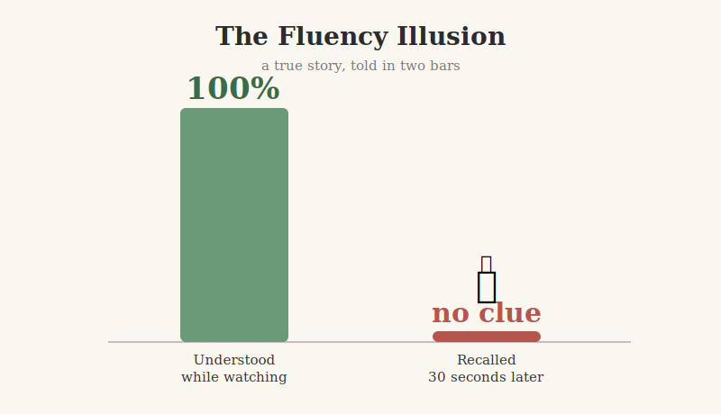

I sat down to push into the next module of the data analytics course. Instead I ran a small experiment on myself, and the result was humbling enough to publish.

The plan was clever. Survey the whole module first — watch everything, build the map, get the shape — before trying to memorize a single thing. Very strategic. The kind of plan you feel smart for having.

So I watched six videos and readings back to back. Analytical skills. The five aspects of analytical thinking. The Five Whys. Quartiles. Google running the numbers on whether managers are worth keeping. I nodded along to every second of it. It all made sense. I felt like a data analyst.

Then my coach asked me to name the five analytical skills from memory.

"No clue."

Not "let me think." Not a shaky partial list. No clue. Thirty seconds after the video, with the full confidence of a man who had understood everything and retained exactly none of it.

Here is the trap nobody flags loudly enough: understanding while you watch feels identical to learning. The information is sitting right in front of you, so you never once test whether you could pull it back out. Take the screen away and the cupboard is bare.

That is the fluency illusion, and it got me clean.

The watching was not wasted — it built the map. But a map is not memory. The remembering only happens when something forces you to retrieve it cold, with nothing to lean on. That part is uncomfortable, which is the whole reason it works.

Next session I do the boring half: close the tabs and try to remember.
