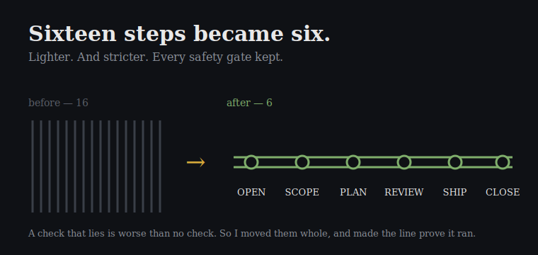

My build pipeline had quietly grown to sixteen steps. Each one earned its place the day I added it. Together they'd become a long corridor I had to walk every time I wanted to change one small thing. You don't notice the weight going on. You notice it the morning it takes four stops to do what should take one.

So today I collapsed it to six. I merged the steps that were doing overlapping work until what was left read like a clean line with six stops instead of a crowded yard: open, scope, plan, review, ship, close. Lighter. The hard part of making something smaller is never the cutting. It's making it smaller without quietly losing one of the things that keeps you safe.

When you fuse two steps, the temptation is to "tidy" the safety checks while you're in there. Rewrite them cleaner. Don't. I moved them whole, word for word — especially the two that are the only thing standing between me and a mistake I can't take back. Clean is for code whose failures are loud. These fail quiet.

## A Check That Lies Is Worse Than No Check

One check I found was reporting "all good" in the exact situation it was built to stop. That's the worst kind of bug. Not the loud one that crashes and tells you. The quiet one that hands you confidence you didn't earn and waves you straight into the thing it was supposed to catch. A missing guard, you respect — you stay sharp. A lying guard, you trust. I killed it and flipped it: when it isn't sure, it stops.

I didn't take my own word that the merge was safe. I ran a throwaway task all the way down the new line, then turned two cold readers loose — fresh eyes, no memory of my work — to find anything I'd eroded. One came back with the only verdict that counted: all six gates intact.

Here's what I keep relearning. Each thing you build teaches you the next. The first merge taught me how to move a guard without breaking it. By the fourth, my hands knew it. Sixteen to six wasn't a cleanup. It was a skill stacked on the last one, and tomorrow it carries.
